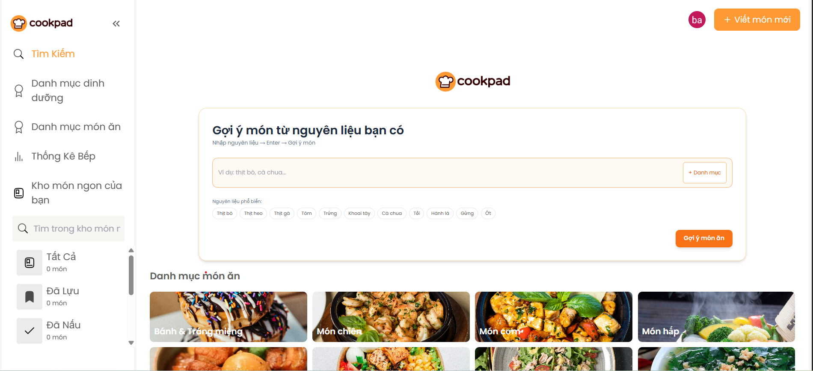
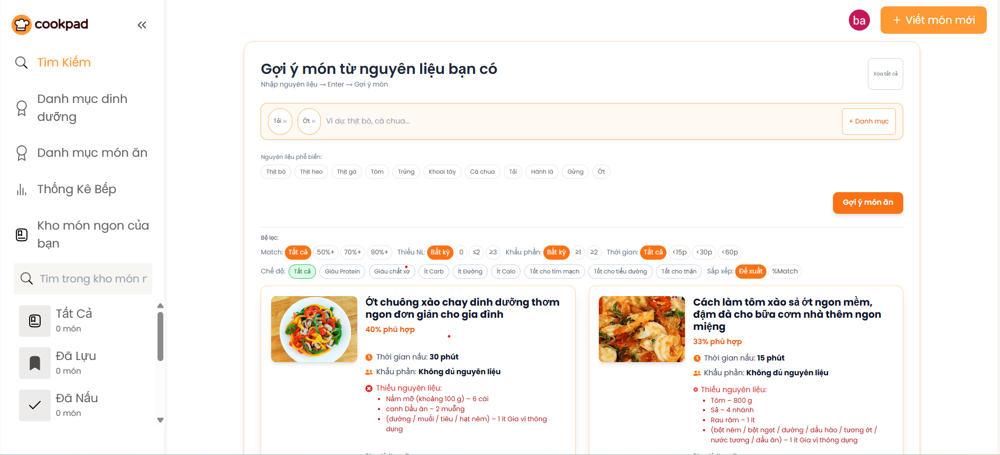
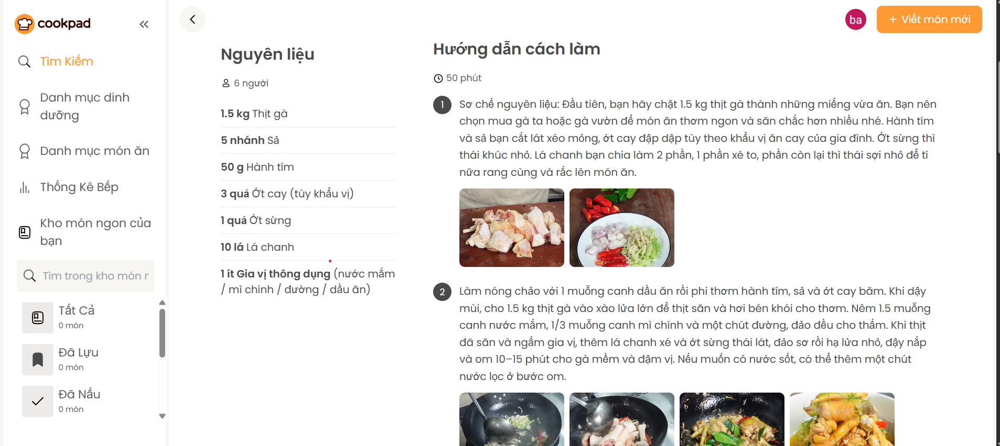
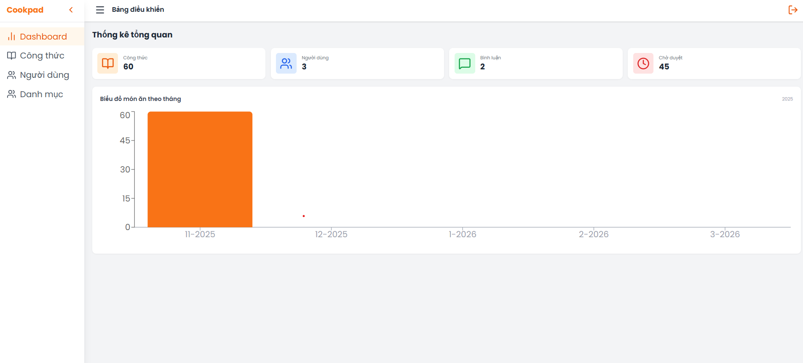

# 🍳 Cookpad Clone – Recipe Sharing Platform

Cookpad Clone là nền tảng chia sẻ và khám phá công thức nấu ăn
Người dùng có thể tìm kiếm món ăn theo **nguyên liệu**, đăng công thức, và quản lý công thức cá nhân.

---

## 🌐 Demo

- **User App:** https://cookpad-clone.vercel.app
- **Admin Dashboard:** https://cookpad-clone.vercel.app/admin/dashboard

---

## 🔑 Admin Account (Demo)

Email: admin@cookpad.vn  
Password: 123456

---

## 🖼 Demo

### Trang chủ

### Tìm kiếm món ăn theo nguyên liệu

### Chi tiết công thức

### Admin Dashboard

---

## 🚀 Tính năng

- Đăng ký / đăng nhập với **JWT Authentication**
- Đăng nhập **Google / Facebook (OAuth 2.0)**
- **Reset Password qua Email**
- Tạo, chỉnh sửa, xóa **công thức nấu ăn**
- Upload hình ảnh món ăn
- Bình luận và lưu món ăn yêu thích
- **Tìm kiếm món ăn theo nguyên liệu**
- Thuật toán **gợi ý món ăn dựa trên độ khớp nguyên liệu**
- Tích hợp **OpenAI** để phân tích dữ liệu dinh dưỡng
- **Admin Dashboard** quản lý người dùng và công thức

---

## 🛠 Tech Stack

**Frontend**

- ReactJS
- TailwindCSS

**Backend**

- Node.js
- ExpressJS
- MongoDB
- Mongoose

**Other**

- JWT Authentication
- OAuth 2.0 (Google / Facebook)
- Nodemailer
- OpenAI API
- GitHub

---

## 📊 Project Scope

- 25+ RESTful APIs
- Thuật toán gợi ý món ăn theo nguyên liệu
- Hệ thống quản trị Admin
